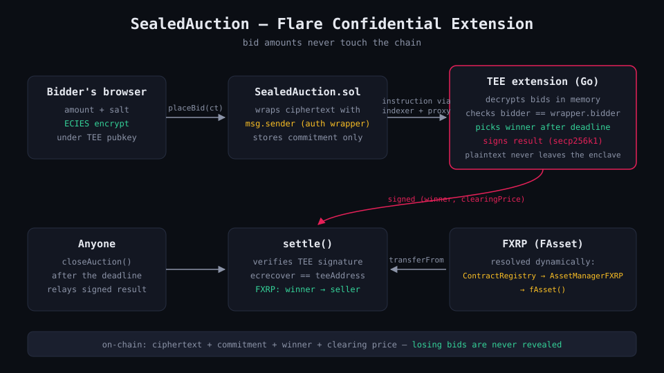

# SealedAuction — Sealed-Bid Auctions as a Flare Confidential Extension

SealedAuction is a first-price sealed-bid auction where bid amounts are
ECIES-encrypted in the bidder's browser and only ever decrypted inside a Flare
TEE — the chain sees opaque ciphertext, and after the deadline the TEE reveals
exactly two numbers: the winner and the clearing price. Settlement is in FXRP
(Flare's bridged-XRP FAsset), resolved on-chain via the FlareContractRegistry,
and verified by checking the TEE's signature in `settle()`.

Built for the **Flare Summer Signal** hackathon on the official
[`fce-extension-scaffold`](https://github.com/flare-foundation) (Go
implementation). Full design: [ARCHITECTURE.md](ARCHITECTURE.md). Demo script:
[DEMO_SCRIPT.md](DEMO_SCRIPT.md).



## Why a TEE and not commit-reveal?

Commit-reveal is the classic trustless answer to sealed bids, and where it
works, it's the right tool. It stops working when you need two things at once:

- **Losers stay private — forever.** In commit-reveal every bidder must
  eventually open their commitment, so all bids become public at reveal time.
  If bid privacy only matters *during* bidding (anti-sniping), commit-reveal
  suffices. If losing bids are commercially sensitive after the auction —
  procurement, OTC blocks, anything repeated against the same counterparties —
  they must never be opened. Here losing bids are decrypted only in enclave
  memory and are never published anywhere.
- **Liveness without reveal games.** A commit-reveal bidder who dislikes the
  outcome can simply refuse to reveal; you patch that with bonds, reveal
  windows, and slashing, and every no-show still delays or distorts the close.
  Here closing needs no cooperation from bidders: anyone calls
  `closeAuction()` once the deadline passes and the TEE ranks whatever it
  holds.

The honest price for this is a trust assumption commit-reveal doesn't have:
you trust the TEE hardware attestation and the registered code hash (and on
Coston2, where the TEE is simulated, you trust the operator — see
[limitations](#honest-v1-limitations)).

## Architecture

```
browser ──ECIES(teePubKey, bid)──▶ SealedAuction.sol ──instruction──▶ indexer ─▶ proxy ─▶ TEE
                                     │ wraps ciphertext with msg.sender          decrypt in memory
                                     │ stores commitment only                    pick winner, sign
                                     ◀───────────── settle(signed result) ◀──────────────┘
                                     verify sig, FXRP: winner ─▶ seller
```

**The `msg.sender` wrapper trick.** The FCC instruction payload (`DataFixed`)
carries no transaction sender, so a naive design would let anyone submit — or
replay — someone else's ciphertext under their own name. SealedAuction closes
this on-chain: `placeBid` wraps the ciphertext as
`abi.encode(PlaceBidMessage{auctionId, msg.sender, ciphertext})`, and the TEE
accepts a bid only if the *encrypted* payload's bidder equals the wrapper's
chain-authenticated `msg.sender`. Spoofing and ciphertext replay both die on
that check.

**On-chain footprint per bid:** the ciphertext (calldata) and
`keccak256(abi.encode(auctionId, bidder, keccak256(ciphertext)))` as a
commitment. The `BidPlaced` event deliberately carries no amount.

**Result verification.** The TEE signs
`keccak256(keccak256(data) ‖ actionId ‖ keccak256(tag) ‖ status)` wrapped in a
`TEE_ACTION_RESULT` / chain-id envelope (the same scheme as the official
weather-insurance FCE); `settle()` reconstructs the digest and requires
`ecrecover == teeAddress` before moving funds.

## Live on Coston2

| Component | Address |
|---|---|
| SealedAuction contract | [`0x5a468D17C292C262C4bAa0A953561bF31CDA79a0`](https://coston2-explorer.flare.network/address/0x5a468D17C292C262C4bAa0A953561bF31CDA79a0) |
| Extension ID | **66042** (`0x…101fa`) |
| TEE machine (status 2 = PRODUCTION) | `0x767F28A6B30EB9528C036378454Da1C2ea11E126` |
| FlareTeeManager | `0x1a9C4A0f9D76c0b1D91d22E24E573a9b377618aE` |
| FXRP — resolved via registry, never hardcoded | [`0x0b6A3645c240605887a5532109323A3E12273dc7`](https://coston2-explorer.flare.network/address/0x0b6A3645c240605887a5532109323A3E12273dc7) (FTestXRP, 6 decimals) |
| FlareContractRegistry → AssetManagerFXRP | `0xaD67FE66660Fb8dFE9d6b1b4240d8650e30F6019` → `0xc1Ca88b937d0b528842F95d5731ffB586f4fbDFA` |

**Recorded FXRP end-to-end** (auction #4 — two sealed bids from two wallets,
TEE picks the winner, FXRP moves winner → seller):

| Step | Tx |
|---|---|
| Sealed bid (losing — amount not derivable from chain) | [`0x5fd884eb…47bec4`](https://coston2-explorer.flare.network/tx/0x5fd884eb8497da248ded72c462eba333fedf9041ed52b202b192c7b1e647bec4) |
| Sealed bid (winning) | [`0x213481bb…178fd3`](https://coston2-explorer.flare.network/tx/0x213481bb3c0da61babeb254a4cd4ee73b51d40e59ebf51a9f04567d16f178fd3) |
| settle() — TEE sig verified, 3 FXRP winner → seller | [`0x2b8c709e…16426a`](https://coston2-explorer.flare.network/tx/0x2b8c709ea2135d6e649feac34b8f5cf2f2b39ec934d003cbe497e46e0c16426a) |

Open either bid tx: the calldata is ECIES ciphertext, byte-shaped the same for
any amount. Grep it for the amounts (`0x1e8480`, `0x2dc6c0`) — they are not
there.

## Run it yourself

Prerequisites: Docker, Go 1.25+, Foundry, jq, Node 22+, a funded Coston2 key
([faucet](https://faucet.flare.network/coston2)), FXRP from the Coston2 FAsset
faucet, a **reserved** tunnel domain (named cloudflared or reserved ngrok —
quick tunnels break TEE registration on restart), and **indexer DB
credentials from the Flare team** for the proxy's `[db]` section (this is the
one thing you cannot self-serve).

```bash
cp .env.example .env.coston2         # fill: DEPLOYMENT_PRIVATE_KEY, INITIAL_OWNER,
                                     #       EXT_PROXY_URL=<your tunnel>, SIMULATED_TEE=true,
                                     #       LOCAL_MODE=false, PAY_TOKEN=FXRP
cp config/proxy/extension_proxy.coston2.docker.toml.example \
   config/proxy/extension_proxy.coston2.docker.toml          # fill [db] credentials
./scripts/use-chain.sh coston2

# one uninterrupted run:
./scripts/pre-build.sh               # deploy SealedAuction + mint a fresh EXTENSION_ID
./scripts/start-services.sh --chain coston2
./scripts/post-build.sh              # allow version + governance + register-tee (rRap)
./scripts/test.sh                    # full E2E: 2 sealed bids → close → settle in FXRP

# frontend:
cd frontend && cp .env.local.example .env.local   # set NEXT_PUBLIC_SEALED_AUCTION from config/extension.env
npm install && npm run dev                        # http://localhost:3000
```

Offline checks (no chain needed): `./scripts/test-unit.sh` (Go table tests),
`./scripts/test-conformance.sh` (golden wire fixtures), `forge test` (19
Solidity tests incl. the full signature scheme against `vm.sign`).

## Honest v1 limitations

- **No bid bonds / escrow.** The winner pays via `transferFrom` at settle; a
  winner who revokes allowance stalls settlement. Production needs a deposit
  at `placeBid`, slashed on non-payment.
- **Volatile TEE bid storage.** Bids live in extension process memory; a TEE
  restart between bidding and close loses them and the auction settles as
  cancelled.
- **First-come tie-break** slightly rewards early bidding; Secure Random is
  the v2 fix.
- **Participation and reserve are public** by design — only amounts are
  sealed.
- **Simulated TEE on Coston2.** With `SIMULATED_TEE=true` (officially
  supported for judging) the operator can technically inspect process memory.
  Real confidentiality requires production TEE hardware attesting the same
  code hash.
- **Seller cannot win their own auction in FXRP** — the FAsset contract
  reverts self-transfers, so settlement to yourself is impossible (arguably a
  feature).

## Roadmap

Production TEE hardware (GCP Confidential Space) → bid bonds/escrow →
Secure-Random tie-breaks → private reserve prices (moved inside the
ciphertext) → sealed-state persistence so bids survive enclave restarts →
other FAssets and Vickrey (second-price) settlement.

## What was built vs. reused

**Reused** (standing on official shoulders): the `fce-extension-scaffold`
skeleton — scripts, Docker/compose, tee-node v0.0.24 wiring, conformance
harness, deployment tooling structure; and patterns from the official
`fce-weather-insurance` reference — the TEE result signature scheme in
`settle()`, the ECIES client flow, and the frontend's proxy-route/wagmi/useTx
wiring.

**Built during the hackathon:** the `SealedAuction` contract (auction
lifecycle, commitment scheme, settle verification), the Go extension
(`PLACE_BID`/`CLOSE_AUCTION` handlers, `pickWinner`, the `msg.sender` wrapper
authentication), the FXRP registry resolver, the two-wallet E2E runner, the
test suites (Go table tests, 14 regenerated conformance fixtures, 19 forge
tests), the Next.js frontend (sealed bid form with in-browser ECIES, auction
lifecycle UI, TEE verify panel), and all documentation.

## Field notes: three things FXRP taught us

Real FAsset settlement broke our mock-tested code three times; each fix is in
the repo and worth knowing before you integrate FXRP:

1. **Anchor deadlines to chain time, not the local clock.** WSL's clock ran
   ~2s ahead of `block.timestamp`; `closeAuction` reverted `bidding still
   open`. The E2E now derives deadlines from the chain head and polls until a
   mined block passes the deadline.
2. **FXRP forbids self-transfers.** `transferFrom(x → x)` reverts with
   `CannotTransferToSelf()` (`0xdad89dca`) — a mock ERC-20 happily allows it.
   Any flow where payer == payee (our first test had seller == winner) must be
   redesigned, not gas-tweaked.
3. **Don't trust `eth_estimateGas` for FAsset transfers.** FXRP's
   reentrancy sentry is gas-sensitive; the estimated limit passes estimation
   and then dies at runtime with `ReentrancySentryOOG`. Pin an explicit gas
   limit with headroom (we use 200k) for direct FXRP transfers.

---

## Scaffold reference

This repo keeps the scaffold's structure, scripts and three-layer test
strategy. The original scaffold documentation lives in `docs/`:

- [Extension Development Guide](docs/extension-guide.md) ·
  [Extension Container Contract](docs/extension-contract.md) (normative wire
  spec) · [Testing Guide](docs/testing.md) ·
  [InstructionSender Contract](docs/instruction-sender.md) ·
  [Reproducibility](REPRODUCIBILITY.md)
- Ops crib sheet: `pre-build.sh` (deploy + register, writes
  `config/extension.env`) → `start-services.sh [--chain coston2]` (redis +
  proxy + extension containers) → `post-build.sh` (allow version, governance,
  `register-tee -command rRap`) → `test.sh`. Ports: proxy external **6674**,
  extension server 7702, sign port 7701, Redis 6382.
